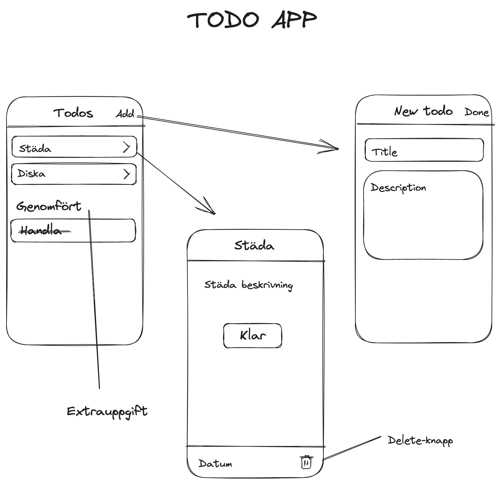

# Todo app i React Native

I dagens uppgift ska vi öva på Navigiering i React Native.



### Sätt upp projektet med React Navigation eller Expo router

#### React Navigation

1. `npx create-expo-app todo-app --template blank`

2. `cd todo-app`

3. `npm install @react-navigation/native`

4. `npx expo install react-native-screens react-native-safe-area-context`

5. `npm install @react-navigation/native-stack`

#### Expo router med Typescript (för javascript gör manuell installation)

1. `npx create-expo-app todo-app`

2. `npm run reset-project`

## Hur du klarar uppgiften

1. Sätt upp en StackNavigator med 3 Screens: Home, Detail och Add.
2. Skapa `[todos, setTodos]` med `useState` på Home, där alla todo-items kommer att ligga.
3. Använd `FlatList` för att visa todos på Home.
4. Varje item i `FlatList` ska kunna navigera till sin Detail-sida. Datan för varje item skickas med i navigate-funktionen. Skicka även med funktioner för att updatera state. T.ex. för Done och Delete. Läs på om att skicka data mellan routes här: [Params](https://reactnavigation.org/docs/params). Använd `TouchableOpacity` som knapp för varje item.
5. Add-sidan ska vara en `Modal`. Se denna guide: [Modal](https://reactnavigation.org/docs/modal/)

## Hur du lämnar in

1. Skapa ett repo på github.
2. Ladd up dina filer till github:

```
git init
git add .
git commit -m "first commit"
git branch -M main
git remote add origin <Adressen till ditt repo>
git push -u origin main
```

3. Klicka på uppgiften i canvas och ange länken till ditt repo.

---

### :boom: Success!

Efter denna uppgift ska ni kunna skapa appar med navigering i React Native.

---

### :runner: Extrauppgifter

Lägg till en Genomfört-sektion under todo-listan. Byt ut `FlatList` mot `SectionList`.
